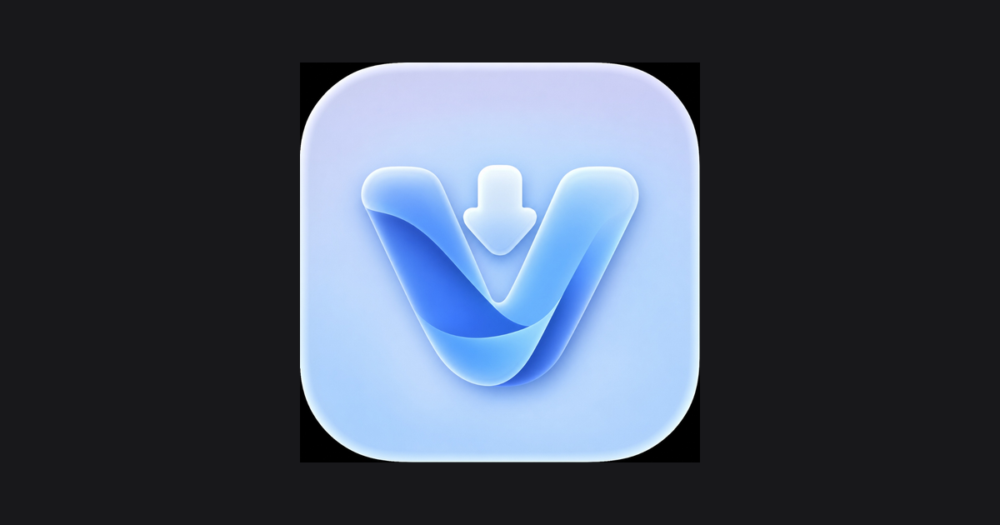

<div align="center">
  
  
  <br />
  <br />

  <h1>VortexDownloader</h1>
  
  <p>
    <strong>Professional high-bitrate media extraction utility. Download videos from YouTube, Vimeo, TikTok, Soundcloud, and more with multi-threaded parallel speeds, lossless audio-video merging, and zero ads.</strong>
  </p>

  <p>
    <a href="#features">Features</a> • 
    <a href="#android-app">Android APK</a> • 
    <a href="#installation">Installation</a> • 
    <a href="#tech-stack">Tech Stack</a> • 
    <a href="#architecture">Architecture</a>
  </p>
</div>

<hr />

## 📱 Android App (v0.4.0)

VortexDownloader is available as a standalone Android application with automatic format detection, 9-category universal normalization matrix (ZIP, PHOTO, AUDIO, VIDEO, DOCUMENT, SPREADSHEET, PRESENTATION, EBOOK, TEXT), auto-conversion to `.mp4` / `.m4a`, dedicated Archived Media Vault page, and 100% internal in-app update installer!

- **Download APK (v0.4.0)**: [**VortexDownloader-v0.4.0.apk**](release/VortexDownloader-v0.4.0.apk)
- **Version**: `0.4.0` (Release v0.4.0)
- **Package ID**: `io.vortexdownloader.app`
- **What's New in v0.4.0**:
  - 🔄 **Universal 9-Category Normalization Matrix**:
    - **`ZIP`** → `.zip`
    - **`PHOTO`** → `.jpg`
    - **`AUDIO`** → `.m4a`
    - **`VIDEO`** → `.mp4`
    - **`DOCUMENT`** → `.pdf`
    - **`SPREADSHEET`** → `.xlsx`
    - **`PRESENTATION`** → `.pptx`
    - **`EBOOK`** → `.epub`
    - **`TEXT`** → `.txt`
  - ⚡ **Automatic Link Detection & Conversion Engine**: Analyzes URLs dynamically by platform signature, file extension, and MIME type to auto-convert videos to `.mp4` and audio tracks to `.m4a`.
  - 🗄️ **Dedicated Archived Media Vault Page**: Categorized history vault with search, format tags, one-click load, copy link, and deletion controls.
  - 🔔 **Live Download Progress Notifications**: Real-time percentage & speed updates in Android notification tray.

### Building Android APK Locally
```bash
# Generate launcher icons from logo
npm run generate:icons

# Build web distribution and sync Capacitor
npm run build:apk

# Compile with Gradle
cd android && ./gradlew assembleRelease
```
The signed APK will be generated at `android/app/build/outputs/apk/release/app-release.apk`.

## ⚡ Features

- **Universal Support**: Powered by `yt-dlp`, supports extraction from over 1000+ media platforms (YouTube, Twitter, TikTok, Vimeo, Soundcloud).
- **High-Bitrate & 4K Ready**: Automatically buffers the highest available video and audio bitrates.
- **Lossless Multiplexing**: Uses `FFmpeg` to cleanly stitch and merge disparate audio and video tracks without loss of quality.
- **Multi-threaded Engine**: Parallel fetch threads ensure maximum bandwidth saturation for faster downloads.
- **Zero Ads, Zero Telemetry**: Clean, sandboxed extraction without referral bloat or trackers.
- **Sleek React Dashboard**: Modern glassmorphic interface, dark mode, terminal logs, and history caching.

## 🚀 Installation & Setup

### Prerequisites
- [Node.js](https://nodejs.org/) (v18+)
- [Python 3.8+](https://www.python.org/)

### 1. Clone & Install
```bash
# Clone the repository
git clone https://github.com/Suvesh108/vortex.git
cd vortex

# Install Node dependencies (includes frontend & backend packages)
npm install
```

### 2. Install Python Core Dependencies
Vortex requires `yt-dlp` and `static-ffmpeg` to process media correctly.
```bash
pip install yt-dlp static-ffmpeg
```

### 3. Run the Development Environment
Start both the Vite frontend and Express backend concurrently:
```bash
npm run dev
```
The application will be accessible at `http://localhost:3000`.

## 🌐 Cloud Deployment

### Option 1: Render (Full-Stack All-in-One — Recommended)
Render runs the Docker container with the Node backend, Python 3, and FFmpeg:
1. Connect your GitHub repository to [Render](https://render.com/).
2. Create a new **Web Service** and choose **Docker** runtime (or apply Blueprint via `render.yaml`).
3. Set the Health Check Path to `/api/health`.
4. Deploy! Your app will be live with full video extraction and stitching capabilities.

### Option 2: Split Deployment (Vercel Frontend + Render Backend)
- **Frontend (Vercel)**:
  1. Import the repository into [Vercel](https://vercel.com/).
  2. Set the Environment Variable: `VITE_API_URL=https://your-backend-service.onrender.com`
  3. Deploy!
- **Backend (Render)**:
  1. Deploy as a Docker Web Service on Render using the included `Dockerfile`.

## 🏗️ Tech Stack

- **Frontend**: React 19, Vite, Tailwind CSS v4, Framer Motion, Lucide Icons.
- **Backend**: Express (Node.js), TypeScript (`tsx`).
- **Extraction Engine**: Python, `yt-dlp` (Stream Extraction), `static-ffmpeg` (Multiplexing).

## 🧠 Architecture Overview

VortexDownloader uses a unique split-tier architecture:
1. **The React Client** provides an aesthetic UI for pasting links and tracking progress visually. It proxies requests via `/api` to the backend.
2. **The Express Server** acts as the command dispatcher, securely handling inbound URLs.
3. **The Python Core (`downloader.py`)** runs as an isolated subprocess. It queries metadata, selects formats, downloads parts concurrently, and instructs `FFmpeg` to stitch the final outputs into the `temp_downloads` cache before delivering them back to the user's browser.

## 📝 License
© 2026 VortexDownloader. Open-source utility. All rights reserved.
