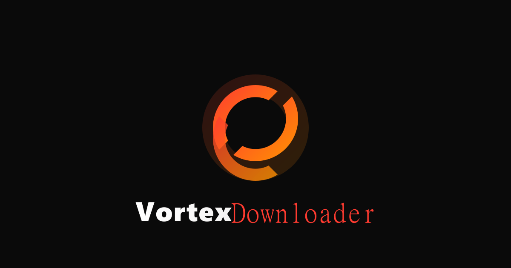

<div align="center">
  
  
  <br />
  <br />

  <h1>VortexDownloader</h1>
  
  <p>
    <strong>Professional high-bitrate media extraction utility. Download videos from YouTube, Vimeo, TikTok, Soundcloud, and more with multi-threaded parallel speeds, lossless audio-video merging, and zero ads.</strong>
  </p>

  <p>
    <a href="#features">Features</a> • 
    <a href="#installation">Installation</a> • 
    <a href="#tech-stack">Tech Stack</a> • 
    <a href="#architecture">Architecture</a>
  </p>
</div>

<hr />

## ⚡ Features

- **Universal Support**: Powered by `yt-dlp`, supports extraction from over 1000+ media platforms (YouTube, Twitter, TikTok, Vimeo, Soundcloud).
- **High-Bitrate & 4K Ready**: Automatically buffers the highest available video and audio bitrates.
- **Lossless Multiplexing**: Uses `FFmpeg` to cleanly stitch and merge disparate audio and video tracks without loss of quality.
- **Multi-threaded Engine**: Parallel fetch threads ensure maximum bandwidth saturation for faster downloads.
- **Zero Ads, Zero Telemetry**: Clean, sandboxed extraction without referral bloat or trackers.
- **Sleek React Dashboard**: Modern glassmorphic interface, dark mode, terminal logs, and history caching.

## 🚀 Installation & Setup

### Prerequisites
- [Node.js](https://nodejs.org/) (v18+)
- [Python 3.8+](https://www.python.org/)

### 1. Clone & Install
```bash
# Clone the repository
git clone https://github.com/yourusername/vortexdownloader.git
cd vortexdownloader

# Install Node dependencies (includes frontend & backend packages)
npm install
```

### 2. Install Python Core Dependencies
Vortex requires `yt-dlp` and `static-ffmpeg` to process media correctly.
```bash
pip install yt-dlp static-ffmpeg
```

### 3. Run the Development Environment
Start both the Vite frontend and Express backend concurrently:
```bash
npm run dev
```
The application will be accessible at `http://localhost:3000`.

## 🏗️ Tech Stack

- **Frontend**: React 19, Vite, Tailwind CSS v4, Framer Motion, Lucide Icons.
- **Backend**: Express (Node.js), TypeScript (`tsx`).
- **Extraction Engine**: Python, `yt-dlp` (Stream Extraction), `static-ffmpeg` (Multiplexing).

## 🧠 Architecture Overview

VortexDownloader uses a unique split-tier architecture:
1. **The React Client** provides an aesthetic UI for pasting links and tracking progress visually. It proxies requests via `/api` to the backend.
2. **The Express Server** acts as the command dispatcher, securely handling inbound URLs.
3. **The Python Core (`downloader.py`)** runs as an isolated subprocess. It queries metadata, selects formats, downloads parts concurrently, and instructs `FFmpeg` to stitch the final outputs into the `temp_downloads` cache before delivering them back to the user's browser.

## 📝 License
© 2026 VortexDownloader. Open-source utility. All rights reserved.
